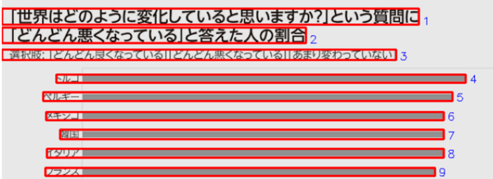

# Factfulness-inspired dashborad

A compact development-data portfolio project combining a reproducible public indicator pipeline with interactive dashboards built in **R Shiny** and 
**Python Streamlit**.

This project is inspired by the [Factfulness](https://www.amazon.co.jp/Factfulness-Reasons-Things-Better-English-ebook/dp/B0769XK7D6) by Hans Rosling idea that public perceptions of the world can diverge from long-run development outcomes.

## Live dashboards
- **R Shiny app**: https://mtk01.shinyapps.io/wb_factfulness/
- **Python Streamlit app**: (under debugging)

## Project overview
This repository demonstrates how to:

- transform irregular public development observations into country-year panel data
- interpolate missing years into a continuous annual series
- extract structured data from a chart image when an API or machine-readable source is not available
- visualize cross-country perception gaps
- compare perceived global decline with observed child survival outcomes

The main example focuses on:

- **Under-five mortality rate (U5MR)**
- **Negativity Instinct ratio**, derived from a Factfulness-related chart

## Main outputs
- cleaned country-year mortality dataset
- interpolated annual U5MR series
- extracted country-level perception dataset from chart image
- interactive map-based dashboards in R Shiny and Streamlit

## Data sources
### Perception data
- Factfulness / Gapminder-style visualization based on survey results from **YouGov** and **Ipsos MORI**
- In this project, the perception dataset is reconstructed from a chart image as a **demonstration of image-based data extraction when an API or tabular source is not available**

### Child mortality data
- **UN Inter-agency Group for Child Mortality Estimation (UN IGME)** observational database  
- Source URL: https://childmortality.org/

## Methodology

### 1. Source data preparation
The pipeline reads the `Total U5MR` sheet from the UN-IGME observational database and:

- removes the first two non-data rows
- keeps only included observations
- converts irregular reference dates into calendar years
- aggregates multiple observations within the same year into one annual record

### 2. Linear interpolation
### Note on missing data
The WDI documentation notes that development data may contain missing values and may not always be fully comparable across countries and years, and that multiple aggregation methods are used depending on the indicator. In this project, I use a simple **linear interpolation** method for demonstration purposes rather than attempting to reproduce the official aggregation rules. [WDI Sources and Methods](https://datatopics.worldbank.org/world-development-indicators/sources-and-methods.html).

If a value is observed at year `x0` and another value is observed at year `x1`, then the interpolated value at year `x` is:

`y(x) = y0 + ((x - x0) / (x1 - x0)) * (y1 - y0)`

where:

- `x0`: earlier observed year
- `x1`: later observed year
- `y0`: observed value at `x0`
- `y1`: observed value at `x1`

This produces a continuous annual trend between observed points.

### 3. Image-based chart extraction
The perception dataset is created from a chart image using OpenCV-based preprocessing and bar-length detection.

The extraction workflow:
- loads the chart image
- converts it to grayscale
- applies thresholding to isolate bars
- uses morphological closing to connect fragmented bar regions
- detects contours corresponding to horizontal bars
- converts bar lengths into approximate percentages using manually specified 0% and 100% anchor positions

This is included as a **practical demo of extracting usable structured data from a published chart image when direct machine-readable data access is unavailable**.

### Example debug view of chart extraction
As part of the extraction workflow, the script identifies horizontal bar regions and visualizes detected contours for manual checking.

> Source image note: Only a partial, reduced-size. It is included solely to illustrate the extraction workflow used in this portfolio project and is not intended as a substitute for the original source.

<p align="center">
  
</p>

> Note: The original chart image used by `scripts/extract_perception_from_chart.py` is not included in this public repository for copyright reasons. The repository includes the extraction script, a small debug excerpt for explanation, and the derived CSV used in the dashboards.

### 4. Interpolation flag
Each interpolated row is explicitly marked so observed and estimated annual values can be distinguished.

## Important note
This project uses the **UN-IGME observational database**, not the official UN-IGME modelled estimates.

`Standard.Error.of.Estimates` in the source file refers to the sampling standard error of the underlying empirical observation, not the uncertainty of the final UN-IGME modelled estimate.

The chart-based perception extraction is an approximate reconstruction for portfolio and demonstration purposes.

## Dashboard features
### R Shiny
A corresponding **R Shiny** version is also available through the live link above.

### Python Streamlit
The `streamlit_app/` dashboard includes:

- country selection
- map-based perception view
- country-level Negativity Instinct ratio
- U5MR trend chart
- 95% confidence interval band
- source attribution and interpolation share

## Repository structure
```text
wb_factfulness_01/
├── README.md
├── requirements.txt
├── src/
│   ├── main.py
│   └── transform.py
├── scripts/
│   └── extract_perception_from_chart.py
├── tests/
│   └── test_transform.py
├── images/
│   └── chart_extraction_debug_excerpt.png
├── R_shiny_app/
│   ├── app.py
│   ├── world_getting_worse_extracted.csv
│   └── u5mr_country_year_all_countries.csv
├── streamlit_app/
│   ├── app.py
│   ├── requirements.txt
│   ├── u5mr_country_year_all_countries.csv
│   └── world_getting_worse_extracted.csv
└── .github/
    └── workflows/
        └── ci.yml
